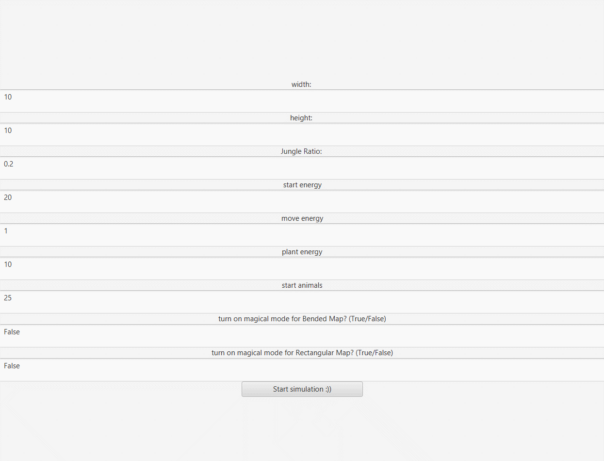
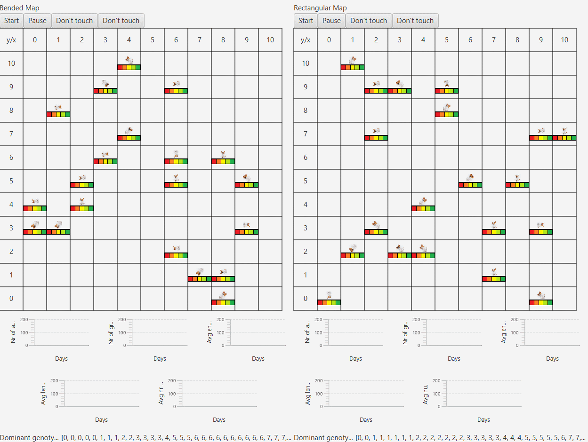

### Life Simulation

##### Maps

The project simulates the life of cute dogs on 2 maps:

- Rectangular Map - animals stop when they reach the edge of the map
- Bended Map - where the animals jump onto other side when they reach the edge of the map

##### Energy

Each animal receives energy when it eats grass and loses it when it multiplies or changes its position on the map. A dog who runs out of energy dies :(

##### Statistics

Below the maps are graphs showing live statistics, such as the number of live animals on the field and the dominant genotype. Users can save the statistics to a CSV file or highlight all dogs with the dominant genotype.

##### Magic mode

In this mode, if 5 dogs remain on the map, the additional animals appear as if by magic.

##### All rules and details

https://github.com/apohllo/obiektowe-lab/tree/master/proj1

### Start Screen

### Main Screen

